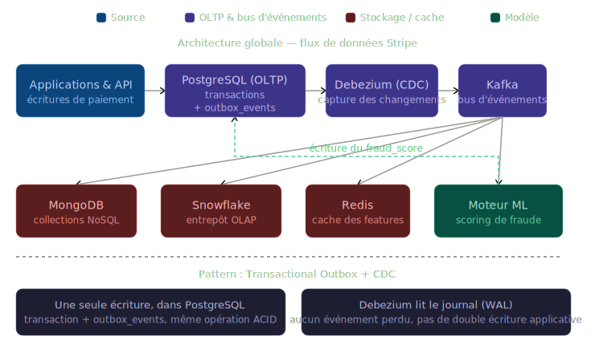
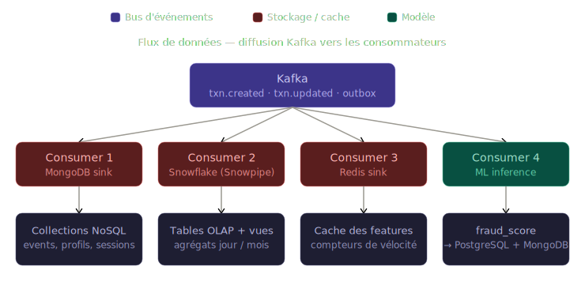
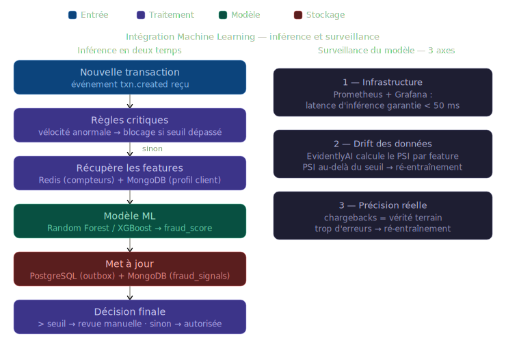

# Stripe — Architecture de données OLTP / OLAP / NoSQL

Projet du bloc 2 de la certification AIA (Architecte en Intelligence Artificielle — Jedha).

Conception d'une architecture de données unifiée pour Stripe, intégrant un système
transactionnel (OLTP), un système analytique (OLAP) et une base documentaire (NoSQL),
avec leur pipeline d'intégration, le plan de sécurité/conformité et l'intégration du
Machine Learning pour la détection de fraude.

---

## Sommaire des livrables

| Livrable | Fichier |
|---|---|
| Stratégie & décisions d'architecture | ce `README.md` |
| Schéma OLTP + OLAP (à importer sur dbdiagram.io) | [`creation_dbdiagram_Stripe.sql`](deliverables/creation_dbdiagram_Stripe.sql) |
| ERD OLTP | [`diagrams/OLTP.png`](deliverables/diagrams/OLTP.png) |
| ERD OLAP | [`diagrams/OLAP.png`](deliverables/diagrams/OLAP.png) |
| Modèle NoSQL (collections MongoDB) | [`nosql_model.md`](deliverables/nosql_model.md) |
| Requêtes SQL & NoSQL | [`queries.md`](deliverables/queries.md) |

---

## 1. Vue d'ensemble & choix technologiques

Trois charges de travail distinctes → trois moteurs spécialisés plutôt qu'une base
unique qui ferait tout mal.

| Besoin | Moteur retenu | Pourquoi |
|---|---|---|
| Transactions (OLTP) | **PostgreSQL** | ACID strict, JSONB pour l'outbox, mature, réplication |
| Analytique (OLAP) | **Snowflake** | séparation stockage/calcul, scaling élastique, fonctions fenêtre |
| Semi-structuré (NoSQL) | **MongoDB** | schéma flexible, lecture par clé rapide, TTL natif |
| Bus d'événements | **Kafka + Debezium** | CDC fiable, découplage des consommateurs |
| Cache temps réel | **Redis** | features de fraude < 10 ms |
| Orchestration | **Airflow** | batch ELT, rafraîchissement des vues matérialisées |

---

## 2. Architecture globale



L'OLTP est la **source de vérité**. Toute modification y est écrite de façon ACID et
publie un événement dans `outbox_events`. Debezium capture ces changements (CDC) et les
pousse dans Kafka, qui alimente ensuite tous les consommateurs en aval de façon découplée.

---

## 3. Modèle OLTP (PostgreSQL)

Schéma normalisé en 3NF — voir [`creation_dbdiagram_Stripe.sql`](deliverables/creation_dbdiagram_Stripe.sql) pour l'ERD complet.

Tables : `merchants`, `customers`, `payment_methods`, `transactions`, `refunds`,
`disputes`, `countries` (référence), `outbox_events`.

### Garantie des propriétés ACID

**Atomicité** — chaque opération métier est encapsulée dans un `BEGIN ... COMMIT`.
L'écriture de la transaction ET l'insertion dans `outbox_events` sont atomiques :
soit les deux réussissent, soit aucune (pas d'événement orphelin).

**Cohérence** — contraintes `CHECK`, `FOREIGN KEY`, `NOT NULL`, `UNIQUE`
(ex: `fingerprint` des moyens de paiement) garantissent des données toujours valides.
Les montants sont stockés en **centimes (`bigint`)**, jamais en float.

**Isolation** — le niveau est choisi selon la criticité :

```sql
-- Scoring de fraude : REPEATABLE READ
-- évite qu'une mise à jour concurrente du fraud_score fausse la décision
BEGIN TRANSACTION ISOLATION LEVEL REPEATABLE READ;
  SELECT fraud_score, status FROM transactions WHERE transaction_id = $1;
  UPDATE transactions SET status='blocked' WHERE transaction_id=$1 AND status='pending';
COMMIT;

-- Débit/crédit financier : SERIALIZABLE + verrou de ligne
BEGIN TRANSACTION ISOLATION LEVEL SERIALIZABLE;
  SELECT balance FROM merchant_accounts WHERE id=$1 FOR UPDATE;
  UPDATE merchant_accounts SET balance = balance - $2 WHERE id=$1;
COMMIT;
```

**Durabilité** — assurée par le WAL (Write-Ahead Log) de PostgreSQL.
En contexte distribué, les `synchronous_commit` sont activés vers les réplicas, avec
un plan de bascule (failover) automatique.

---

## 4. Modèle OLAP (Snowflake)

Schéma en **étoile** — voir [`creation_dbdiagram_Stripe.sql`](deliverables/creation_dbdiagram_Stripe.sql).

Une table de faits `fact_transactions` au centre, entourée de dimensions
`dim_merchant`, `dim_customer`, `dim_payment_method`, `dim_date`, `dim_geography`.
Les dimensions marchand et client sont en **SCD Type-2** (historisation des changements
de tier / segment via `valid_from` / `valid_to` / `is_current`).

### Traitement des requêtes

- **Jointures à grande échelle** : le schéma en étoile minimise le nombre de jointures.
  Les petites dimensions (< 10 valeurs distinctes) se *broadcastent* facilement entre
  les nœuds ; la grande table de faits utilise des **clés de clustering** sur
  `(date_id, merchant_sk)`.
- **Sous-requêtes** : gérées via des **CTE** (Common Table Expressions), évaluées une
  seule fois et matérialisées.
- **Séries temporelles** : **fonctions fenêtre** (`SUM ... OVER`, `LAG`, `NTILE`) qui
  évitent les self-joins coûteux (voir Q3, Q4).

### Optimisation des performances

Pré-agrégation des données brutes à différentes granularités :

| Vue | Granularité | Usage |
|---|---|---|
| `mv_hourly_fraud` | horaire (48 h max) | détection de fraude |
| `mv_daily_revenue` | quotidienne | revenus, dashboards |
| `mv_monthly_summary` | mensuelle | analyses long terme |

Le rafraîchissement se fait par **swap atomique** : une table *staging* est construite
en arrière-plan puis échangée avec la production, sans interruption de service.

---

## 5. Modèle NoSQL (MongoDB)

Détail complet dans [`nosql_model.md`](nosql_model.md).

Cinq collections : `transaction_events`, `customer_profiles`, `user_sessions`,
`ml_features`, `audit_log`. Les **identifiants OLTP sont réutilisés** comme `_id` pour
la transversalité. Le choix *embedding vs referencing* suit le mode d'accès dominant
(ex: profil client entièrement embarqué pour un scoring en un seul accès disque).

---

## 6. Pipeline de données & intégration



**Pattern Transactional Outbox + CDC** : on évite le *dual-write* (écrire à la fois
en base et dans Kafka, source d'incohérences). L'application écrit uniquement en
PostgreSQL ; Debezium lit le journal et garantit qu'aucun événement n'est perdu.

- **Temps réel** : Kafka diffuse en continu (fraude, mises à jour MongoDB, cache Redis).
- **Batch** : Airflow orchestre l'ELT nocturne vers Snowflake et le rafraîchissement
  des vues matérialisées.
- **Cohérence** : éventuelle (eventual consistency) côté analytique et NoSQL, forte
  côté OLTP. Les IDs canoniques partagés permettent la réconciliation.

---

## 7. Plan de sécurité & conformité

Données sensibles : **PII** (Personally Identifiable Information) et
**PAN** (Primary Account Number). Les deux sont **chiffrées avant l'entrée** dans le
système (tokenisation), puis re-chiffrées **au repos** (AES-256) et **en transit** (TLS).
Les accès suivent le principe du **moindre privilège**.

### Sécurité des données

| Risque | Mesure | Responsable |
|---|---|---|
| Fuite de données | Chiffrement AES-256 + TLS | Admin système |
| Accès non autorisé | RBAC (Role-Based Access Control) | Directeur sécurité |
| Perte de données | Sauvegardes quotidiennes + plan de reprise (DRP) | DBA |
| Manipulation frauduleuse | Logs d'audit immuables + alertes automatisées | Data Engineer |

### Conformité (RGPD / PCI-DSS / CCPA)

- **Minimisation** — seules les données utiles sont stockées (email haché, pas le PAN).
- **Anonymisation** — identifiants masqués avant usage analytique.
- **Consentement explicite** — requis pour les données comportementales.
- **Droit à l'oubli** — suppression complète sur demande ; l'`audit_log` reste lisible
  car il embarque les états (pas de référence pendante).
- **Journalisation** — chaque accès est tracé ; logs archivés sur S3 en mode
  *compliance* (non effaçables pendant une durée légale).

---

## 8. Intégration du Machine Learning (détection de fraude)



**Inférence en deux temps** : d'abord des **règles critiques** (vélocité anormale) qui
flaggent immédiatement les fraudes évidentes sans appeler le modèle ; sinon, le modèle
score la transaction à partir des features mises en cache (Redis) et du profil client
(MongoDB), puis met à jour PostgreSQL (via l'outbox) et MongoDB.

### Monitoring du modèle — trois axes

1. **Infrastructure** — latence d'inférence faible garantie (< 50 ms).
2. **Drift des données** — surveillance temps réel (ex: EvidentlyAI). Si le PSI
   (Population Stability Index) dépasse un seuil → ré-entraînement déclenché.
3. **Précision réelle** — les **chargebacks** (litiges) sont la vérité terrain : un
   chargeback = une mauvaise décision passée. Trop de chargebacks → ré-entraînement.

---

## Stack

- PostgreSQL (OLTP — modèle 3NF, ACID, WAL)
- Snowflake (OLAP — schéma en étoile, SCD Type-2, vues matérialisées)
- MongoDB (NoSQL — collections flexibles, embedding/referencing)
- Kafka + Debezium (bus d'événements — CDC, Transactional Outbox Pattern)
- Redis (cache features temps réel < 10 ms)
- Apache Airflow (orchestration ELT batch)

---

## Structure

```
Bloc-2/
├── deliverables/
│   ├── creation_dbdiagram_Stripe.sql       # Schéma OLTP + OLAP (dbdiagram.io)
│   ├── nosql_model.md                      # Modèle NoSQL — collections MongoDB
│   ├── queries.md                          # Requêtes SQL & NoSQL
│   └── diagrams/
│       ├── OLTP.png                        # ERD OLTP (PostgreSQL 3NF)
│       ├── OLAP.png                        # ERD OLAP (schéma en étoile)
│       ├── stripe_architecture_globale.svg
│       ├── stripe_data_flows.svg
│       └── stripe_ml_integration.svg
├── docs/
│   └── instructions.md                     # Énoncé du projet
├── stripe_logo.png
└── README.md
```

---

Julien CHARLIER — [(Github : Atomik31)](https://github.com/Atomik31)
